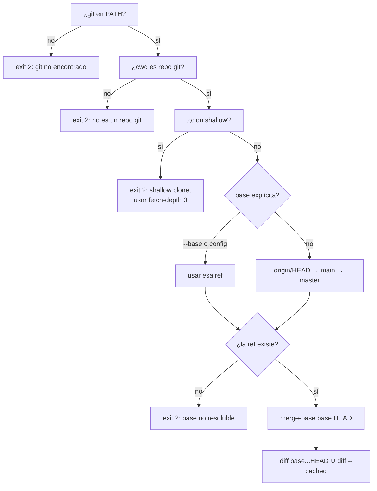

## Context

El pedido es simple de enunciar —"no permitir un commit si el PR toca más de 15 archivos"— y tiene
tres trampas que las herramientas existentes del mercado no resuelven o resuelven mal.

**Trampa 1: la unidad de medida.** Un hook `pre-commit` ve el índice, no el PR. Contar los archivos
del commit en curso deja pasar cinco commits de 4 archivos. La unidad correcta es el diff acumulado
de la rama contra su base de merge.

**Trampa 2: el gate en verde.** F-018 documentó siete defectos donde un lens respondía `OK` sobre un
árbol que no había podido analizar. `scopelens` tiene más superficie para ese defecto que ningún
otro lens: depende de un proceso externo (`git`), de la existencia de una rama base, y de que el
clon no sea shallow. Cada uno de esos tres puede producir "0 archivos" en vez de un error.

**Trampa 3: el conteo honesto castiga los buenos PRs.** Un cambio de 8 fuentes + 8 tests + un
lockfile regenerado son 17 archivos. Con un techo de 15, el gate bloquea el PR que trae tests y deja
pasar el que no los trae. Sin clasificación por ecosistema el tool es contraproducente.

Restricciones vigentes: stdlib únicamente (ADR-002), 100% de cobertura (ADR-011), TDD (ADR-013),
archivos bajo 100 líneas (ADR-005), `osExit` + `run([]string) int` en `main.go`, `pathmatch`
compartido (F-018 fase 1).

## Goals / Non-Goals

**Goals**

- Abortar el commit cuando el diff acumulado rama↔base supera el presupuesto de archivos
- Nunca reportar un conteo que el tool no pudo determinar con certeza
- Que el número contado sea defendible en los tres ecosistemas sin config manual
- Costo por invocación despreciable: dos `git diff --name-only`, sin leer contenido de archivos

**Non-Goals**

- Reemplazar el labeler en CI. `scopelens` es el gate temprano; el CI puede seguir etiquetando.
- Métricas de líneas, complejidad o churn histórico.
- Adivinar la intención: un refactor legítimo de 40 archivos se destraba con `--no-verify` o
  subiendo `maxFiles` en la config, no con heurísticas.

## Decisiones

### D1. `git` como dependencia externa → ADR nuevo

ADR-002 prohíbe dependencias **de runtime en Go**. `scopelens` no agrega ninguna: agrega una
dependencia de un binario del sistema. Es un tipo de acoplamiento nuevo en el monorepo y necesita su
propio ADR (`docs/adr-020-scopelens-dependencia-git.md`).

Alternativa descartada: leer `.git/` directamente. Requiere implementar packfiles, deltas y el índice
binario — cientos de líneas de parsing frágil para reimplementar peor lo que `git` ya hace. La
decisión es `os/exec` con `exec.CommandContext` y timeout, `git` invocado con `--no-optional-locks`
para no interferir con otros procesos git en curso.

### D2. Descubrimiento de la base, y qué hacer cuando falla



Los cuatro `exit 2` son el corazón del diseño. Ninguno degrada a `exit 0`. `exit 1` queda reservado
exclusivamente para "el gate midió y el resultado excede el presupuesto", igual que en los otros
lenses.

Caso borde: **rama sin base** (commit inicial, o rama que ya es `main`). Si `HEAD` es la rama por
defecto, `merge-base` contra sí misma da `HEAD` y el diff acumulado es vacío — sólo cuenta lo
staged. Es el comportamiento correcto: commitear directo en `main` no tiene "PR" que medir, y el
presupuesto aplica al commit individual.

### D3. Unión de conjuntos, no suma

```
tocados = set(diff --diff-filter=ACMRD -M <merge-base>...HEAD)
        ∪ set(diff --diff-filter=ACMRD -M --cached)
```

Es unión y no suma porque un archivo modificado en un commit previo **y** ahora staged es un solo
archivo de superficie de review. `-M` hace que un rename cuente 1 y no 2 (borrado + creado); sin él,
un renombrado de paquete duplica su costo en el presupuesto. `--diff-filter=ACMRD` incluye los
borrados: un archivo eliminado es superficie de review real.

`--staged-only` limita el conteo al segundo conjunto, para equipos que trabajan con un commit por PR.

### D4. Clasificación por ecosistema

Tres categorías, calculadas con `pathmatch` sobre la ruta (nunca leyendo el archivo):

| Categoría | Cuenta contra el presupuesto | Criterio |
|---|---|---|
| `excluded` | No | Matchea `exclude` de la config (defaults por ecosistema abajo) |
| `test` | Sí, salvo `--exclude-tests` | Layouts de test de JS/TS, Python, Go |
| `source` | Siempre | Todo lo demás |

Defaults de `exclude`, unificados (todos activos siempre; un repo Go no se rompe por excluir
`pnpm-lock.yaml`, que no existe ahí):

- **Comunes**: `.git/**`, `node_modules/**`, `vendor/**`, `dist/**`, `build/**`, `coverage/**`
- **JS/TS**: `package-lock.json`, `pnpm-lock.yaml`, `yarn.lock`, `.next/**`, `.nuxt/**`, `out/**`,
  `**/__snapshots__/**`
- **Python**: `poetry.lock`, `Pipfile.lock`, `uv.lock`, `**/__pycache__/**`, `*.egg-info/**`,
  `.venv/**`
- **Go**: `go.sum`, `**/*.pb.go`, `**/zz_generated*.go`

Detección de `test` (mismo criterio que testlens tras F-015, para no divergir):

- **JS/TS**: `*.test.*`, `*.spec.*`, `**/__tests__/**`, `**/tests/**`
- **Python**: `test_*.py`, `*_test.py`, `**/tests/**`
- **Go**: `*_test.go`

`--exclude-tests` (default `false`) descuenta la categoría `test`. El default es contarlos porque el
conteo honesto es el que refleja la carga de review; el flag existe para el equipo que decide que su
presupuesto es de superficie de producción.

### D5. Precedencia de configuración (ADR-018, sin desviación)

```
1. flags CLI (--max-files, --base, --exclude-tests, …)
2. scopelens.json en la raíz
3. pyproject.toml → [tool.scopelens]
4. package.json → "scopelens": { … }
5. composer.json → extra.open-harness.scopelens
6. defaults compilados (maxFiles: 15)
```

`maxFiles` default 15 porque es el número que motivó el tool y coincide con el rango
`M`/`L` de los labelers del mercado (30 y 50 archivos son sus umbrales; 15 es deliberadamente más
estricto).

### D6. Salida

```
scopelens 0.1.0 — fix-audit-findings vs origin/main (merge-base a1b2c3d)

  FAIL: 18 files (max 15)

  source (14)
    tools/scopelens/main.go
    tools/scopelens/gitcmd.go
    …
  test (4)
    tools/scopelens/main_test.go
    …
  excluded (3)
    go.sum                    lockfile
    pnpm-lock.yaml            lockfile

SUMMARY: 18 counted, 3 excluded, limit 15
```

Mismo esqueleto que `linelens`: bloque de detalle + `SUMMARY`, colores desactivables con
`--no-color`, sección de excluidos con motivo (reutiliza el patrón `printSkips`/`Skip.Reason`).

## Impacto arquitectónico

- **Crea ADR-020**: `git` como dependencia de binario externo (alcance: sólo `scopelens`).
- **Extiende ADR-018**: `scopelens` entra en la cadena de config multi-ecosistema.
- **Extiende ADR-009**: el repo queda protegido por su propio quinto lens.
- **Consume F-018 fase 1**: `pathmatch` para todo el matching; cero lógica de globs propia.
- **No modifica** ADR-002: no se agrega ninguna dependencia Go.

## Testing strategy

TDD estricto (ADR-013), 100% de statements (ADR-011). El adaptador de `git` se aísla tras una
interfaz de un método para que el resto del tool se testee sin tocar el disco:

```go
type gitRunner func(ctx context.Context, args ...string) ([]byte, error)
```

- **Unit, sin git**: parseo de `--name-only`, unión de conjuntos, clasificación, precedencia de
  config, formateo. Fake `gitRunner` con salidas fijas, incluyendo rutas con espacios y con quoting
  de git (`"caf\303\251.ts"`) y salida vacía.
- **Unit de errores**: `git` ausente, exit code ≠ 0, timeout, shallow, base inexistente. Cada uno
  verifica `exit 2` **y** que el mensaje nombra la causa y la acción.
- **Integración, con git real**: `t.Skip` si `git` no está en `PATH`. Repos temporales construidos en
  `testdata/` por script: rama con 3 commits, rename, borrado, staged, shallow clone, repo sin
  commits, detached HEAD.
- **Determinismo**: el orden del reporte se ordena explícitamente (lección de `testlens`, que
  iteraba un map). Test que corre el mismo caso 20 veces y exige salida byte-idéntica.
