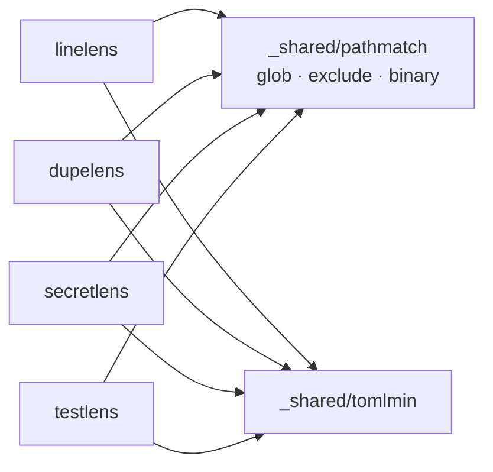
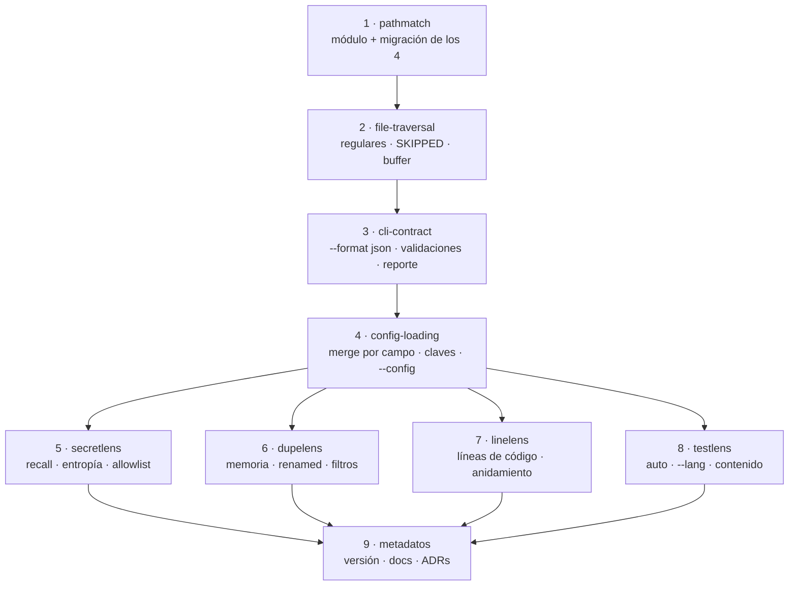

## Context

La auditoría adversarial sobre `59a1371` reprodujo 18 defectos en los cuatro tools. Al agruparlos
por causa raíz quedan cuatro clases, y solo una es "el análisis es flojo":

| Clase | Defectos | Causa raíz |
|---|---|---|
| Gates que fallan en verde | 7 | Errores tratados como "sin hallazgos" |
| Motor de rutas divergente | 3 | 3 copias byte-idénticas + 1 reimplementación peor |
| Contrato de CLI desparejo | 5 | Cada tool creció por su cuenta |
| Calidad del análisis | 3 | Decisiones de diseño explícitas que no envejecieron bien |

La clase dominante no es de precisión sino de **honestidad del resultado**: `secretlens` responde
`OK: no secrets detected` sobre un árbol donde no pudo leer nada, y `testlens` responde
`All source files have tests` cuando el `--lang` tenía un typo. Ese es el eje del diseño.

Restricciones vigentes: stdlib únicamente (ADR-002), 100% de cobertura de statements (ADR-011),
TDD estricto (ADR-013), archivos bajo 100 líneas, `osExit` + `run([]string) int` en cada `main.go`.
Los cuatro tools ya están publicados en npm, de modo que hay usuarios reales con configs vigentes.

## Goals / Non-Goals

### Goals

- Que ningún tool afirme un resultado limpio sobre archivos que no analizó.
- Un único motor de rutas para los cuatro, eliminando las copias.
- Contrato de CLI homogéneo: mismos flags, mismo formato, mismos exit codes.
- Recall de secretlens por encima del 90% sobre el fixture de auditoría.
- Techo de memoria de dupelens proporcional al fuente.
- Fixtures de la auditoría versionados como `testdata/`, de modo que las regresiones las detecte
  `go test` y no una auditoría manual.

### Non-Goals

- Paralelizar el walk. Medido: 0,04 s por 158k líneas en linelens; en dupelens el cuello es memoria.
- Salida SARIF. Se habilita al tener `--format json`, pero no se implementa acá.
- AST real en dupelens. ADR-012 eligió Rabin-Karp sobre AST deliberadamente; la normalización de
  identificadores respeta esa decisión en lugar de revertirla.
- Resolución de imports en testlens para atribuir tests de integración.
- Un motor de configuración unificado entre los cuatro. Sus esquemas difieren legítimamente.

## Decisions

### D1 — `tools/_shared/pathmatch` como módulo Go con su propio `go.mod`

`matchGlob`/`isExcluded` están copiados carácter por carácter en linelens, dupelens y secretlens;
testlens escribió su propia versión con `strings.Contains`, que es el origen del defecto por el cual
`src/routes/` queda excluido cuando `exclude` contiene `out`.

**Elegido**: módulo separado bajo `tools/_shared/`, referenciado desde los cuatro `go.mod` y sumado
a `go.work`, replicando exactamente el patrón ya avalado de `tools/_shared/tomlmin`.

**Alternativas descartadas**:
- *Un solo módulo Go para todo el monorepo*: rompería el aislamiento de compilación por tool, que es
  la base de ADR-001/002 (un binario estático e independiente por herramienta).
- *Copiar el motor bueno a los cuatro*: mantiene cuatro copias divergentes, que es el problema.
- *`go:generate` para sincronizar copias*: complejidad sin beneficio sobre un módulo.

No introduce dependencias externas: `pathmatch` es stdlib puro. **ADR-002 queda intacto.**

### D2 — Resultado de escaneo con tres estados, no dos

Hoy `scanFile` devuelve `(resultado, error)` y las cuatro implementaciones hacen
`if err != nil { return nil }`. Un archivo ilegible queda indistinguible de uno limpio.

**Elegido**: el escaneo pasa a devolver un tercer estado explícito, `Skipped{Path, Reason}`, que el
reporter imprime bajo `SKIPPED` y que participa del exit code según el motivo:

| Motivo | ¿Rompe `--fail`? | Razón |
|---|---|---|
| `read error` | Sí | El usuario esperaba análisis y no lo hubo |
| `line exceeds buffer limit` | Sí | Ídem; además esconde bundles minificados |
| `binary` | No | Omisión intencional y esperada |
| `not a regular file` | No | Ídem |

**Alternativas descartadas**:
- *Abortar al primer error*: un `.git` con permisos raros rompería el gate entero.
- *Solo un contador de omitidos*: no dice cuál ni por qué, y no es accionable.
- *Subir el buffer a 10 MB*: mueve el umbral sin resolver el silencio. Se sube igual a 4 MB, pero
  el reporte de omitidos es lo que arregla el defecto.

### D3 — El FIFO se resuelve en el walk, no en la lectura

`os.ReadFile` sobre un named pipe bloquea sin timeout. Poner timeouts por archivo introduce
goroutines y cancelación en cuatro tools.

**Elegido**: filtrar por `d.Type().IsRegular()` en el `WalkDir`, dentro de `pathmatch`. Un solo
punto, sin concurrencia, sin timeouts.

### D4 — Entropía como filtro, no como detector

**Elegido**: la entropía de Shannon se aplica **sobre el valor ya capturado por una regla**, nunca
como detector independiente sobre texto arbitrario. Un detector por entropía puro sobre cualquier
token largo genera falsos positivos en hashes, UUIDs, base64 de imágenes y sumas de verificación.

Umbral inicial 4.0 bits/carácter, calibrado contra el fixture de auditoría y configurable vía
`minEntropy`. **Crea ADR-021**, porque ADR-010 documentó el diseño del detector como puramente
basado en patterns.

**Alternativas descartadas**:
- *Solo agregar patterns de proveedor*: no cubre secretos internos sin prefijo conocido.
- *Solo entropía*: precisión inaceptable, según lo anterior.
- *Verificación contra la API del proveedor*: exfiltraría el secreto y rompe ADR-002.

### D5 — Allowlist por match, y `example` fuera del default

El allowlist se evalúa hoy contra la línea completa antes de correr ninguna regla, de modo que
`# see example above` desactiva la detección de esa línea. Se mueve la evaluación al valor
capturado. `example` sale del default por ser subcadena de `example.com`, un host que aparece en
cadenas de conexión reales.

Es **BREAKING** para quien dependa de suprimir líneas enteras. Se documenta en el README con nota de
migración: usar `exclude` por ruta para archivos de documentación.

### D6 — Patterns aditivos con opt-out explícito

`cfg.Patterns = append(defaultPatterns(), cfg.Patterns...)`, con `disableDefaultPatterns: true` para
el comportamiento anterior. El README ya prometía comportamiento aditivo ("Override to **add**
custom rules"), así que esto alinea la implementación con el contrato documentado.

Es **BREAKING** para quien haya usado patterns custom *contando con* que reemplazaran a los
built-in. La migración es una clave de una línea, y el modo actual pierde detecciones en silencio.

### D7 — Fingerprints sin ventana materializada

`Fingerprint.Window []string` retiene los 50 tokens en cada posición: con N tokens se guardan N×50
headers de string, de donde sale el factor ~100× (2.370 MB por 24 MB de fuente).

**Elegido**: `Fingerprint{Hash uint64, FileID int, StartIdx int}`, manteniendo el slice de tokens una
vez por archivo. La verificación literal contra colisiones —que hoy funciona bien y no se quiere
perder— se hace comparando sobre ese slice por índice.

**Alternativas descartadas**:
- *Winnowing*: reduce el conjunto de fingerprints pero no el costo por fingerprint, que es el
  problema. Además pierde matches. Se difiere.
- *Volcar a disco*: complejidad y E/S para un problema que es de representación.
- *Cap de archivos*: silencia el análisis en los repos donde más se necesita.

### D8 — Clones renombrados en un segundo conjunto de fingerprints

Se emiten dos conjuntos: uno sobre tokens crudos (`exact`) y otro con identificadores no-keyword
normalizados a `ID` y literales numéricos a `NUM` (`renamed`). Duplica el costo de hashing, que es
barato; la memoria sigue acotada por D7.

Por defecto `--fail` cuenta solo los `exact`. Los `renamed` tienen más falsos positivos en
boilerplate (constructores, DTOs, handlers CRUD), y un gate ruidoso se termina desactivando.
`--fail-on=exact|renamed|all` permite subir el rigor cuando el equipo lo decide.

**Extiende ADR-012** (Rabin-Karp sobre AST): la normalización se hace sobre el stream de tokens que
ADR-012 ya estableció, sin introducir un parser por lenguaje.

### D9 — testlens verifica contenido, con un lector barato

Un `x_test.go` vacío marca cubierto un paquete entero. Verificar contenido exige leer el candidato,
lo que testlens hoy no hace (solo `os.Stat`).

**Elegido**: leer el archivo candidato y buscar el marcador de test del lenguaje (`func Test`, `it(`,
`test(`, `def test_`, `#[test]`) con corte temprano en el primer match. Solo se leen los archivos
candidatos, no todo el árbol.

**Alternativa descartada**: parsear con `go/ast`. Resuelve solo Go y no los otros cinco lenguajes.

### D10 — Detección de lenguaje: orden fijo y máximo, no primero-que-pase

Dos defectos con la misma raíz: iteración sobre un `map` de Go. Se recorre la lista ordenada de
lenguajes soportados, se cuenta cada uno y gana el de mayor conteo; el umbral de >5 archivos
desaparece (hoy hace que ningún proyecto pequeño se detecte). Los `exclude` se aplican **durante**
la detección, no después.

`supportedLanguages()` y `extensionsForLanguage()` ya existen en `language.go` y hoy son código
muerto: pasan a ser el camino real, lo cual además resuelve el `--lang` inválido.

### D11 — Cadena de config: implementar el merge por campo que dice ADR-018

Hay dos salidas: implementar el merge o corregir el ADR. Se elige **implementar**, porque el
comportamiento descrito es el correcto para el caso que motivó ADR-018 (un repo Python con
`pyproject.toml` y un `package.json` de tooling frontend), y porque corregir el ADR dejaría el caso
sin resolver.

Implementación: recorrer la cadena acumulando, rellenando solo los campos aún no definidos.
Requiere punteros o un mapa de presencia para distinguir "no definido" de "definido en cero".
**Extiende ADR-018** con una sección de semántica verificable.

### D12 — Claves desconocidas: error, no aviso

`DisallowUnknownFields` y exit 1. Un aviso en stderr se pierde en el ruido de CI, y el caso testigo
es el propio `testlens.json` del repo: lleva meses declarando `skip` y `languages` sin efecto y
nadie lo notó.

Es **BREAKING** para configs con claves espurias. Es exactamente la clase de config que hoy no hace
lo que su autor cree.

### D13 — linelens cuenta código y anida

Se reutiliza el stripper de comentarios de dupelens, que ya está en el monorepo y hay que mover a
compartido de todos modos. El reporte muestra ambas métricas (código y físico) para no romper la
intuición del usuario que compara contra `wc -l`.

La profundidad de anidamiento se cuenta con el balance de llaves/`do`/`end` sobre el stream de
tokens ya despojado de comentarios y strings. No es complejidad ciclomática y no se presenta como
tal: es la métrica barata que responde "qué archivo tengo que partir", que es la pregunta que hoy
linelens no responde.

**Descartado**: complejidad ciclomática real. Requiere un parser por lenguaje y es el alcance de
`bigo` (F-001), no de linelens.

## Architecture Decision Impact

| ADR | Impacto |
|---|---|
| ADR-001 (un binario por tool) | Intacto: `pathmatch` se compila estáticamente dentro de cada binario |
| ADR-002 (cero dependencias) | Intacto: `pathmatch` es stdlib pura, igual que `tomlmin` |
| ADR-006 (semántica glob gitignore) | **Corregido**: `**` no cruzaba separadores, contra lo que el ADR describe |
| ADR-010 (diseño del detector de secretlens) | **Extendido** por ADR-021 (entropía) |
| ADR-011 (100% cobertura) | Intacto y usado como gate por fase |
| ADR-012 (Rabin-Karp sobre AST) | **Extendido**: normalización de identificadores sobre el stream de tokens |
| ADR-013 (TDD) | Intacto: cada defecto entra como test rojo antes del fix |
| ADR-018 (config multi-ecosistema) | **Extendido**: se implementa el merge por campo que ya describe |
| ADR-020 (nuevo) | Módulo compartido `pathmatch` |
| ADR-021 (nuevo) | Entropía como filtro en secretlens |
| ADR-014 (colisión) | Existen dos archivos ADR-014 distintos; el de testlens se renumera a ADR-022 |

## Testing Strategy

TDD estricto por ADR-013, con el ciclo aplicado **por defecto de auditoría**, no por fase:

1. **Rojo**: cada uno de los 18 defectos entra primero como test que reproduce el comando exacto de
   la auditoría y falla. Los fixtures del scratchpad se versionan como `testdata/` del tool
   correspondiente.
2. **Verde**: implementación mínima.
3. **Refactor**: absorción en `pathmatch` una vez que los tests de los cuatro tools están verdes.
4. **Gate por fase**: `go test ./... && go tool cover -func` con 100% de statements (ADR-011), más
   `lefthook run pre-commit` sobre el propio repo.

Tres casos necesitan andamiaje específico:

- **No determinismo** (D10): test que corre la detección 20 veces y exige un único resultado
  distinto. Sin esto, un fix parcial pasa por casualidad.
- **Memoria** (D7): test con `runtime.ReadMemStats` sobre un fixture generado, con techo asertado.
  Se marca como test largo para no penalizar el ciclo normal.
- **Recall de secretlens** (D4): el fixture de 20 secretos con su conteo esperado como test de tabla,
  de modo que el recall sea una aserción y no una medición manual.

El código de producción muerto de testlens (`reporter.go` completo, `scanner.go:20-58`) se borra
antes de tocar nada más: hoy infla el 100% de cobertura con rutas que `check` nunca ejecuta, y
mantenerlo obligaría a testear dos implementaciones paralelas del mismo reporte.

## Risks / Trade-offs

- **Los cambios en testlens rompen el pre-commit del propio repo** → Fase de testlens al final, y
  `lefthook run pre-commit` tras cada fase. El repo es su propio caso de prueba (ADR-009).
- **Tres cambios BREAKING en un solo release** (D5, D6, D12) → Se agrupan en un único bump de minor
  con nota de migración en el README. Los tres tienen la misma naturaleza: configuraciones que hoy
  no hacen lo que su autor cree.
- **La entropía introduce falsos positivos nuevos** → Se aplica solo sobre valores ya capturados por
  una regla (D4), y el fixture de auditoría mide precisión además de recall.
- **Los clones `renamed` generan ruido** → Fuera del gate por defecto (D8).
- **`pathmatch` se convierte en punto único de falla para los cuatro** → Es el objetivo; se mitiga
  con cobertura 100% del módulo y con los tests de comportamiento de cada tool sobre el mismo árbol.
- **El merge por campo (D11) complica `loadConfig`** → Contenido, porque los cuatro esquemas son
  chicos; si un tool queda sobre 100 líneas, se separa en `config_merge.go`.
- **Bajar `dupelens.json` a `minTokens` default expone 38 duplicados** → Es el resultado buscado:
  los 38 desaparecen al absorber las copias en `pathmatch`. Se baja el umbral en la última fase.

## Migration Plan

Nueve commits atómicos, en orden de dependencia:

Las fases 5 a 8 son independientes entre sí y pueden reordenarse. Ninguna se marca `[done]` con
tests rojos o cobertura por debajo del 100%.

**Rollback**: `git revert` de la fase; solo las fases 5-8 dependen de la 1. El bump de versión y la
publicación a npm son la última tarea de la fase 9, de modo que cualquier rollback anterior no llega
a ningún usuario.

## Open Questions

1. **Umbral de entropía**: 4.0 bits/carácter es el punto de partida; el valor definitivo sale de
   calibrar contra el fixture. Si no existe umbral que dé ≥90% de recall con ≥80% de precisión, la
   decisión es priorizar recall y documentarlo.
2. **Merge por campo y `exclude`**: ¿los arrays se concatenan entre archivos de la cadena o el
   primero gana entero? ADR-018 no lo dice. Propuesta: **el primero que lo defina gana entero**, por
   ser predecible; se documenta en el ADR.
3. **Extensiones de código por defecto** (D8/D13): una lista compartida entre linelens y dupelens, o
   una por tool. Propuesta: compartida en `pathmatch`, ya que ambos la necesitan idéntica.
4. **`--fail` y los omitidos**: si un repo tiene un archivo ilegible permanente (montaje de CI, por
   ejemplo), el gate queda rojo hasta que se lo excluya. ¿Se acepta, o hace falta
   `--allow-skipped`? Propuesta: aceptarlo; agregar el flag solo si aparece el caso real.
