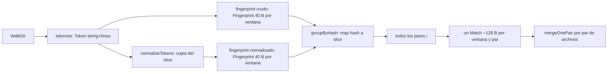
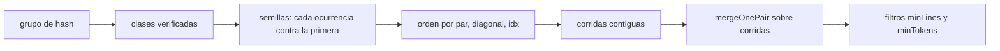
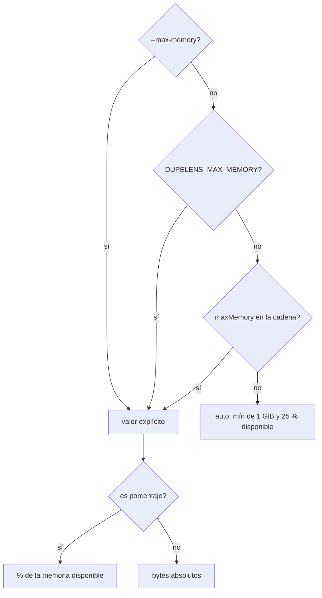

## Context

Motivación y mediciones: ver `proposal.md` (Why). Requisitos: ver los deltas de `duplicate-detection`
y `cli-contract`.

Estado actual del pipeline (`tools/dupelens`, 0.4.1):

Restricciones que dan forma al diseño: stdlib únicamente (ADR-002), archivos ≤ 100 líneas de código
(ADR-005), 100 % de cobertura (ADR-011), TDD (ADR-013) y los binarios para linux-x64, darwin-arm64,
darwin-x64 y win32-x64.

## Goals / Non-Goals

**Goals:**
- Eliminar el eje cuadrático: memoria y CPU lineales en el número de copias de un bloque.
- Bajar la constante lineal a un múltiplo chico del fuente.
- Un presupuesto de memoria que se haga cumplir dentro del proceso, en las cuatro plataformas.

**Non-Goals:**
- Escanear por encima del presupuesto (partición en varias pasadas, derrame a disco).
- Paralelizar el escaneo.
- Cambiar el schema del reporte JSON.

## Decisions

### D1. Semillas ancladas y fusión por diagonal

Las huellas se agrupan por hash. Dentro de un grupo, las ocurrencias se separan en clases de contenido
idéntico (verificación literal contra los tokens, como hoy). En cada clase, ordenada por (ruta,
posición), cada ocurrencia distinta de la primera produce **una semilla** `(fileA, idxA, fileB,
idxB)` emparejada con la primera.

Las semillas se ordenan por (par de archivos, diagonal `idxB − idxA`, `idxA`). Cada semilla se
**extiende** sobre su diagonal, hacia atrás y hacia adelante, mientras las ventanas de ambos archivos
tengan los mismos tokens y pasen los filtros de ruido (monotonía y, en `renamed`, baja entropía). Las
semillas que ya cubrió una extensión de la misma diagonal se saltan, así que cada tramo se recorre una
vez. Sobre esas corridas se aplica la fusión por líneas que existe hoy (`mergeOnePair`), y el conteo
de tokens pasa a ser el tramo que abarcan en A.

La extensión salió de la validación contra 0.4.1. Sin ella, cuando un archivo anterior en el orden
comparte solo parte de un bloque, el ancla cambia a mitad de camino y las corridas del par quedan en
pedazos por debajo de `minTokens`. Caso real: `encodings/cp850.py` ↔ `cp852.py` (58 tokens idénticos)
desaparecía del reporte.

Validación sobre árboles reales, contra el binario 0.4.1 publicado:

| Árbol | Hallazgos 0.4.1 → nuevo | Se mantienen | Implícitos por anclaje | Sin explicar | `--fail` |
|---|---|---|---|---|---|
| stdlib de Python | 3215 → 359 | 324 | 2787 | 104 (103 renamed) | 1 → 1 |
| numpy | 1825 → 610 | 458 | 247 | 1120 (1096 renamed) | 1 → 1 |
| matplotlib | 222 → 104 | 69 | 6 | 147 (144 renamed) | 1 → 1 |
| yt_dlp | 107 → 96 | 22 | 8 | 77 (renamed) | 1 → 1 |

Los "sin explicar" que se inspeccionaron son conteos inflados de 0.4.1. La fusión vieja contaba
`windowSize + pares − 1` sumando pares de ventanas de alineaciones distintas, y en código periódico
(listas de constantes, firmas de función parecidas, `ID ID ID ''` normalizado) declaraba bloques que
en ninguna alineación eran contiguos. Ejemplo: `matplotlib/pyplot.py` `csd()` ↔ `specgram()` se
reportaba con 71 tokens y el tramo contiguo real es de 31.

Cada ventana aporta como mucho una semilla, así que el total de semillas está acotado por el número de
ventanas: el costo deja de depender de k².

Alternativas consideradas:
- *Todos los pares, con semillas compactas*: baja la constante pero conserva k² en memoria y CPU; con
  1000 módulos generados, el caso `fortios`, sigue sin terminar.
- *Reportar clases de clones (k ocurrencias por hallazgo)*: es la forma natural del resultado, pero
  cambia el schema JSON y la lectura del reporte. Queda fuera de alcance.
- *Suffix array / suffix tree*: costo lineal y teóricamente más preciso, pero con más código y más
  memoria por token que el rolling hash, que ADR-012 ya eligió.

**Estado:** adoptada por defecto el 2026-10-08 (el anclaje k−1 era la opción recomendada y no hubo
respuesta explícita). Si se prefiere reportar todos los pares, cambia el requirement "Hallazgos
anclados a la primera ocurrencia".

### D2. Representación compacta

- **Tokens internados**: un diccionario `string → uint32` por ejecución y, por archivo, dos slices
  `[]uint32` (id y línea): 8 B por token. El diccionario crece con el vocabulario, que es sublineal
  en el tamaño del fuente.
- **Forma normalizada por tabla**: `normOf[id]` se calcula una vez por token distinto. Desaparece la
  copia `norm` por archivo.
- **Huellas compactas**: pares (hash, posición global) en un slice que se ordena, en lugar del
  `map[uint64][]Fingerprint`. Las líneas se derivan de los tokens cuando hacen falta.
- **Prefiltro de ventanas únicas**: una primera pasada de hashing marca en dos bitsets "visto una vez" y
  "visto dos o más veces". Solo las ventanas marcadas como repetidas se materializan como huellas.
  Un falso positivo del bitset solo agrega una huella que la verificación descarta.
- **Hash de 61 bits** (módulo 2^61−1 con `math/bits.Mul64`) en lugar de `1e9+7`: con cientos de
  millones de ventanas, el módulo actual produce millones de colisiones falsas que inflan los grupos
  y el prefiltro.

Alternativa descartada: guardar un hash de 64 bits por token en vez de un id internado. Ahorra el
diccionario, pero la verificación deja de ser literal y el requirement "La verificación literal se
conserva" exige que lo sea.

### D3. Presupuesto: un solo valor, absoluto o porcentaje

`maxMemory` (clave), `--max-memory` (flag) y `DUPELENS_MAX_MEMORY` (env) aceptan `<n>MiB`, `<n>GiB` o
`<n>%`. Sin valor explícito rige `auto` = mín(1 GiB, 25 % de la memoria disponible). Un valor explícito
reemplaza el default tal cual.

La clave vive en la raíz de la config (al lado de `exclude`) porque no es un parámetro de detección.
La cadena de configuración la recorre campo por campo sin cambios en `tools/_shared/`. `dupelens init`
no la escribe: la clave ausente equivale a `auto`, y escribir un valor fijo cambiaría el default. Se
documenta en `--help`, `--tutorial`, el README y `docs/CONFIGURATION.md`.

Alternativas consideradas:
- *Dos claves (`maxMemory` y `maxMemoryPercent`) combinadas con mínimo*: quien sube `maxMemory` a 4 GiB
  puede recibir menos por el porcentaje, sin verlo en su config.
- *Porcentaje de la RAM total*: con varias instancias en paralelo, cada una calcula sobre la misma
  cifra fija. El porcentaje sobre la memoria *disponible* baja a medida que otras instancias ya
  ocupan memoria.

**Estado:** el 25 %, la variable de entorno y la precedencia flag > env > config > auto fueron
adoptados por defecto el 2026-10-08, sin confirmación explícita.

### D4. Memoria disponible por plataforma

| Plataforma | Fuente | Archivo |
|---|---|---|
| Linux | `MemAvailable` de `/proc/meminfo`; el cgroup propio según `/proc/self/cgroup`: v2 `memory.max − memory.current`, v1 `memory.limit_in_bytes − memory.usage_in_bytes`, recorriendo los ancestros y tomando el menor | `memavail_linux.go` |
| macOS | `hw.memsize` vía `syscall.Sysctl` (RAM total: el SO no expone la disponible sin cgo) | `memavail_darwin.go` |
| Windows | `GlobalMemoryStatusEx` (`ullAvailPhys`) vía `syscall.NewLazyDLL("kernel32.dll")` | `memavail_windows.go` |
| Otras | indeterminable → 1 GiB | `memavail_other.go` |

El parseo de `/proc/meminfo` y de los archivos del cgroup va en funciones puras, portables y testeadas
en todas las plataformas. Los adaptadores por SO se reducen a leer y delegar.

### D5. Hacer cumplir el presupuesto

1. `debug.SetMemoryLimit` al 90 % del presupuesto: el GC mantiene la basura bajo control antes de
   llegar al tope.
2. **Puntos de control** después de cada archivo escaneado, cada 64 Ki semillas y antes del reporte.
   Cada uno lee `runtime/metrics` (`/memory/classes/total:bytes` − `/memory/classes/heap/released:bytes`,
   la memoria que el runtime tiene tomada del SO). Si supera el presupuesto, se corta con exit `2` y
   el mensaje que pide el spec.

La función que mide y la que lee la memoria disponible son variables de paquete, igual que `osExit`,
para que los tests las reemplacen de forma determinista.

Alternativas descartadas:
- *Solo `GOMEMLIMIT` / `SetMemoryLimit`*: es un límite blando. Medido: el RSS siguió por encima del
  límite y el tiempo se cuadruplicó por thrashing.
- *`setrlimit(RLIMIT_AS)`*: el runtime de Go reserva espacio de direcciones virtual de más y falla al
  arrancar. Además no existe en Windows.
- *Un goroutine vigilante con ticker*: no es determinista en tests, y los puntos de control en los
  bucles ya acotan el exceso.

### D6. Exit 2 en dupelens

Se reutiliza la semántica que scopelens ya tiene documentada: `2` = "no se pudo medir", que nunca se
trata como aprobación. Los errores de uso y de config de dupelens siguen en `1` para no romper a
quien ya los distingue.

### Impacto en ADRs

- **Crea ADR-024** "dupelens: presupuesto de memoria y hallazgos anclados", con D1, D3, D5 y D6.
- **Extiende ADR-012** con una sección sobre las semillas ancladas y el hash de 61 bits.
- **ADR-011**: los adaptadores `memavail_darwin.go` y `memavail_windows.go` no se compilan en Linux,
  donde se mide la cobertura. Se justifica porque se limitan a una llamada al SO y toda la lógica
  vive en funciones portables con 100 % de cobertura. Queda documentado en ADR-024.

### Estrategia de testing (TDD)

- **Red → Green** por cada requirement:
  - escenarios de anclaje con `testdata` de tres copias;
  - resolución del presupuesto con `t.Setenv` y configs en `t.TempDir()`;
  - parseo de `/proc/meminfo` y del cgroup con fixtures de texto;
  - exceso con el medidor inyectado devolviendo un valor por encima del presupuesto.
- **Memoria (unitario, sensible a `-short`)**: con `TotalAlloc`, igual que `memory_test.go`, se
  comprueba que 32 copias asignan menos de 2,5 veces lo que asignan 16 copias.
- **End-to-end (fuera de `go test`)**: un script corre el binario en un cgroup con
  `systemd-run --user --scope -p MemoryMax=…` sobre las 32 copias de `asyncio` y sobre
  `fortinet/fortios`, y compara el pico de RSS con el binario publicado en `npm/@open_harness/dupelens-linux-x64/bin/`.
- **Regresión**: todos los tests actuales de `duplicate-detection` siguen en verde, salvo los que
  cuentan pares de tres o más copias, que se actualizan al anclaje.
- Cobertura objetivo: 100 % statement coverage en `tools/dupelens`.

## Risks / Trade-offs

- [Las estimaciones de ~2-3x el fuente no están medidas] → La primera tarea es un spike sobre los
  datasets del proposal; si M1+M2 no bajan el pico, se revisa este diseño antes de seguir.
- [El anclaje baja los conteos de hallazgos y puede sorprender en el upgrade] → Nota en
  `docs/UPGRADING.md` y CHANGELOG; `--fail` da el mismo resultado.
- [La fusión por diagonal puede cambiar los rangos de algunos hallazgos] → Las corridas pasan por la
  misma `mergeOnePair` de hoy; los tests de rango existentes actúan de red de seguridad.
- [`runtime/metrics` no ve memoria fuera del runtime de Go] → dupelens no usa cgo ni mmap. La métrica
  elegida es una cota superior del heap más las pilas.
- [El porcentaje se mide una vez al arrancar: instancias lanzadas en el mismo instante ven la misma
  cifra] → El tope de 1 GiB de `auto` acota el peor caso; la coordinación entre procesos queda fuera de
  alcance.
- [Un repo muy grande pasa a bloquear el pre-commit con exit 2] → El mensaje nombra el presupuesto, su
  origen y las tres formas de subirlo, además de `exclude`.
- [macOS usa la RAM total, no la disponible] → Documentado. `auto` sigue acotado por 1 GiB.

## Migration Plan

1. Implementar detrás de los tests (tasks.md), con el spike primero.
2. Bump dupelens 0.4.1 → 0.5.0; `docs/UPGRADING.md` explica el anclaje y el exit 2.
3. Release de dupelens solo: npm (wrapper + 4 plataformas), PyPI y meta.
4. Rollback: republicar 0.4.1 como recomendada. Quien necesite más memoria sin degradar usa
   `--max-memory 100%` o la clave equivalente.

## Open Questions

- Frecuencia exacta de los puntos de control en la fase de semillas (64 Ki es un punto de partida). Se
  ajusta con el spike sin cambiar specs ni tareas.
